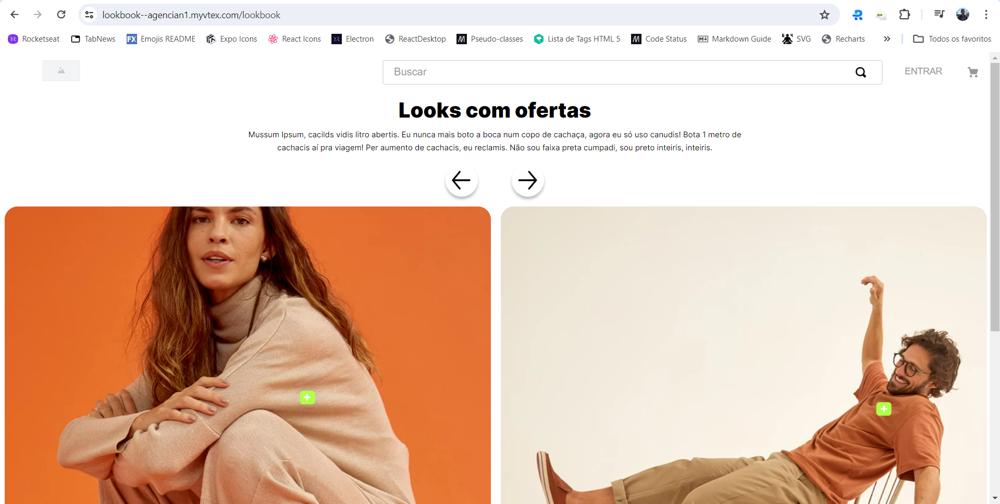
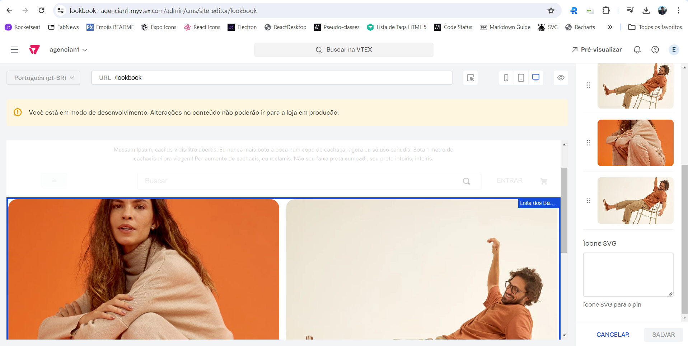
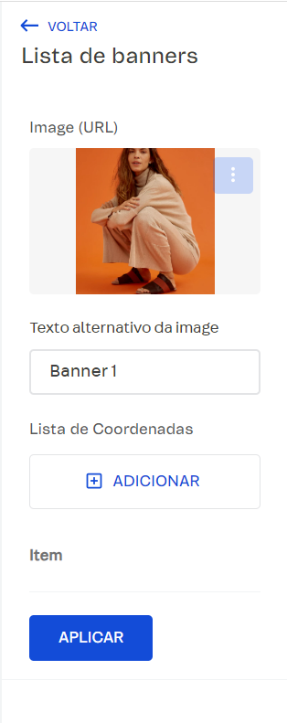

# Look Book

<!-- DOCS-IGNORE:start -->
<!-- ALL-CONTRIBUTORS-BADGE:START - Do not remove or modify this section -->

<!-- ALL-CONTRIBUTORS-BADGE:END -->
<!-- DOCS-IGNORE:end -->

## Informações

O Look Book é um componente versátil que permite criar um slider de banners para uso em sites e aplicativos. Com essa funcionalidade, os clientes podem inserir marcadores interativos diretamente nos banners do site do editor. Cada marcador serve como um ponto de referência, que, ao ser clicado, abre um modal contendo informações adicionais sobre um produto específico. Isso é útil para destacar produtos, fornecer detalhes adicionais ou até mesmo criar uma experiência interativa para os visitantes do site. O Look Book pode ser configurado para permitir que os clientes personalizem a aparência e o conteúdo do modal, tornando-o uma ferramenta flexível para marketing e promoção de produtos.

## Configurações 

Para adicionar banners e pontos no Look Book, você precisa primeiro localizar o bloco "Lista de Banners" no site editor. Dentro desse bloco, você encontrará um campo para carregar uma imagem. Aqui, o cliente deve selecionar o banner que deseja usar. Logo abaixo desse campo, há o componente "Lista de Coordenadas", onde você pode adicionar pontos interativos que acionam modais de informação.

Para adicionar um ponto no banner, siga estas etapas:

1. Adicionar um Novo Ponto: Clique no botão "Adicionar" no componente "Lista de Coordenadas". Isso abrirá uma seção com dois campos: um para as coordenadas e outro para o ID do produto.
2. Selecionar Coordenadas: Para definir a posição do ponto, clique no local desejado na imagem do banner. Em seguida, pressione "Ctrl + V" para colar as coordenadas no campo apropriado. As coordenadas serão automaticamente convertidas para valores percentuais, garantindo que os pontos permaneçam no lugar correto mesmo se o tamanho do banner mudar.
3. Adicionar ID do Produto: No campo para o ID do produto, insira o ID do produto que deseja vincular ao ponto. Este ID será usado para renderizar o modal com as informações do produto quando o ponto for clicado.
4. Salvar as Alterações: Depois de adicionar os pontos e seus respectivos IDs de produto, certifique-se de salvar as alterações para que as informações sejam refletidas no site.

Este processo permite criar banners interativos com pontos clicáveis, cada um abrindo um modal com informações detalhadas sobre produtos específicos. A funcionalidade de coordenadas baseada em porcentagem facilita a posição dos pontos, garantindo precisão e flexibilidade na configuração do Look Book.

## Customização

**Página Criar Look**

| CSS  |  description |
| ----------- |  ----------- | 
| `banner-element-container` | Div principal que contém a imagem e os Pin. |
| `banner-element-banner` | Imagem principal do Banner. |
| `look-book--container` | Div principal que contém o slider. |
| `modal-product-container` | Modal Flutuante que contém as informações do produto. |
| `modal-product-close-btn` | Botão para fechar o modal. |
| `modal-product-reference` | Div que divide as informações do produto. |
| `modal-product-data` | Div que contém as informações do produto. |
| `modal-product-info` | Div que contém as informações do produto como valores e o botão de redirecionamento. |
| `modal-product-image-content` | Div que contém a imagem. |
| `modal-product-redirect` | Botão que redireciona para a PDP |
| `modal-product-price` | Preco do produto. |
| `modal-product-name` | Nome do produto. |
| `modal-product-list-price` | List Price do produto. |
| `modal-product-image` | Imagem do produto. |
| `pin-container` | Container do Pin. |
| `pin-reference` | Div de referencia para aplicar o position relative para o modal do produto. |
| `pin-btn` | Botão para abrir o modal. |